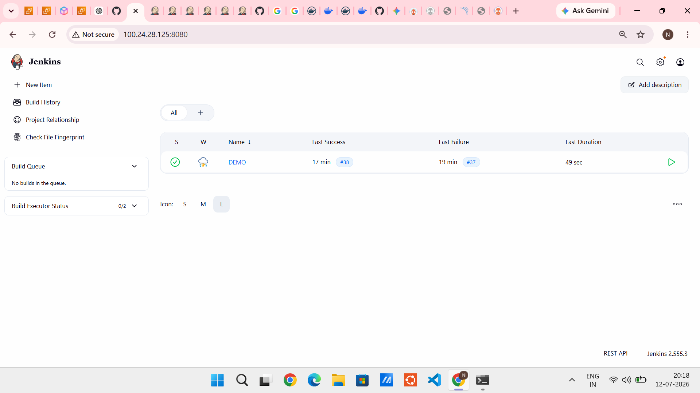
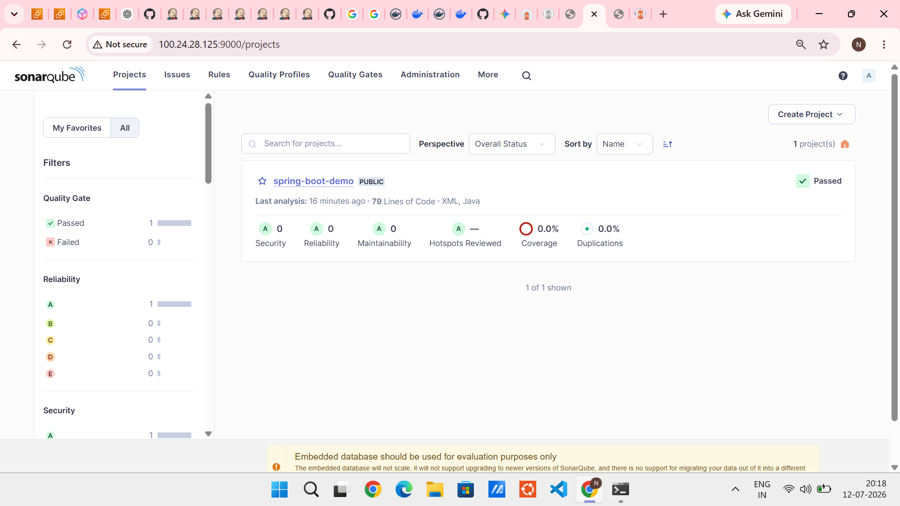
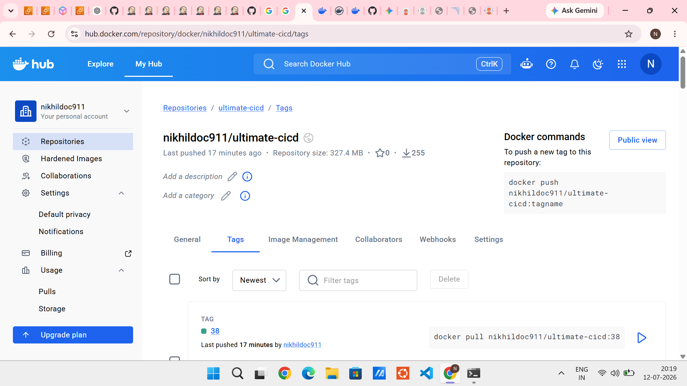
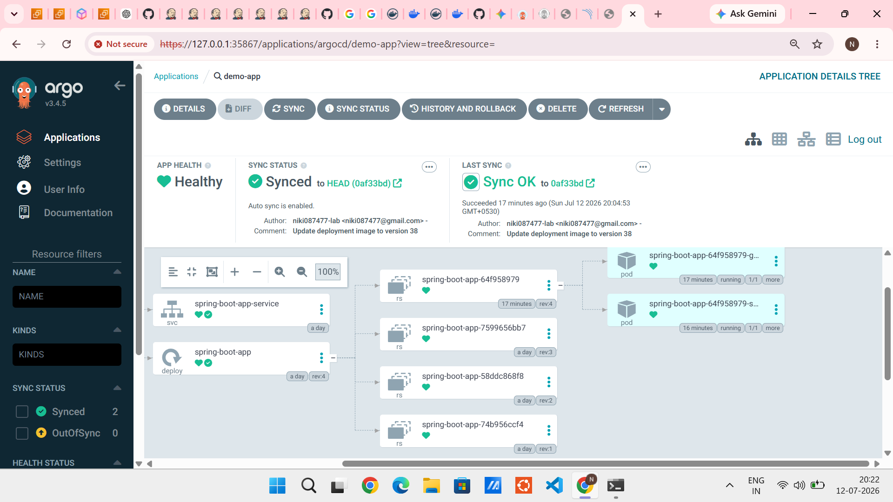
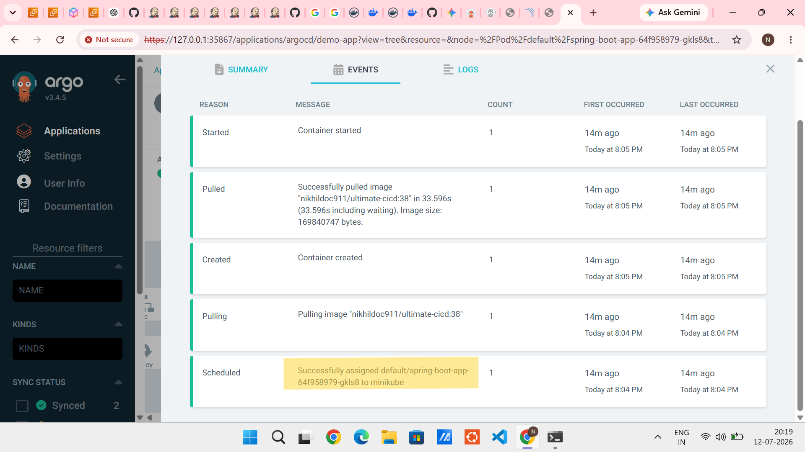
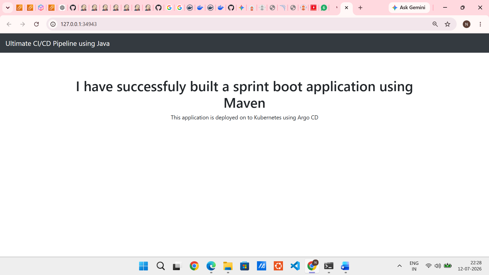

# 🚀 Ultimate CI/CD Pipeline using Jenkins, SonarQube, Docker, Kubernetes & Argo CD

<p align="center">


</p>

---

# 📖 Project Overview

This project demonstrates a complete **CI/CD pipeline** for deploying a Java Spring Boot application using modern DevOps practices.

The pipeline automatically performs source code checkout, Maven build, static code analysis with SonarQube, Docker image creation, image publishing to Docker Hub, deployment manifest update, and continuous deployment to Kubernetes using Argo CD.

This project helped me gain hands-on experience with Continuous Integration, Continuous Deployment, GitOps, containerization, Kubernetes orchestration, and DevOps troubleshooting.

---

# 🏗️ Architecture

```text
                   Developer
                       │
                       ▼
                GitHub Repository
                       │
                       ▼
                 Jenkins Pipeline
                       │
        ┌──────────────┼──────────────┐
        │              │              │
        ▼              ▼              ▼
  Maven Build   SonarQube Scan   Docker Build
                                       │
                                       ▼
                              Push Image to Docker Hub
                                       │
                                       ▼
                          Update Kubernetes Manifest
                                       │
                                       ▼
                            Push Changes to GitHub
                                       │
                                       ▼
                                  Argo CD
                                       │
                                       ▼
                              Kubernetes Cluster
                                       │
                                       ▼
                          Spring Boot Application
```

---

# ⚙️ Tools & Technologies

| Category | Technology |
|-----------|------------|
| Programming Language | Java |
| Framework | Spring Boot |
| Build Tool | Maven |
| Source Control | Git & GitHub |
| CI Tool | Jenkins |
| Code Quality | SonarQube |
| Containerization | Docker |
| Image Registry | Docker Hub |
| Container Orchestration | Kubernetes (Minikube) |
| GitOps | Argo CD |
| Operating System | Ubuntu Linux |
| Cloud Platform | AWS EC2 |

---

# 🚀 CI/CD Workflow

### Step 1

Developer pushes source code to GitHub.

↓

### Step 2

Jenkins detects the latest commit.

↓

### Step 3

Jenkins checks out the source code.

↓

### Step 4

Maven compiles the project and packages the application.

↓

### Step 5

SonarQube performs static code analysis.

↓

### Step 6

Docker builds a new application image.

↓

### Step 7

Docker image is pushed to Docker Hub.

↓

### Step 8

Jenkins automatically updates the Kubernetes deployment manifest with the latest Docker image tag.

↓

### Step 9

Updated manifest is committed back to GitHub.

↓

### Step 10

Argo CD detects the GitHub repository changes.

↓

### Step 11

Argo CD synchronizes the Kubernetes cluster.

↓

### Step 12

Kubernetes deploys the latest version of the application.

---

# 📂 Repository Structure

```
.
├── Jenkinsfile
├── Dockerfile
├── deployment.yaml
├── service.yaml
├── pom.xml
├── src/
├── screenshots/
└── README.md
```

---

# 📸 Project Screenshots

## Jenkins Dashboard



---

## Successful Jenkins Pipeline


---

## SonarQube Code Analysis



---

## Docker Hub Repository



---

## Argo CD Application



---

## Kubernetes Deployment



---

## Running Spring Boot Application



---

# 🖥️ Important Commands

## Build Application

```bash
mvn clean package
```

## Run SonarQube Analysis

```bash
mvn sonar:sonar
```

## Build Docker Image

```bash
docker build -t nikhildoc911/ultimate-cicd:<tag> .
```

## Push Docker Image

```bash
docker push nikhildoc911/ultimate-cicd:<tag>
```

## Deploy Application

```bash
kubectl apply -f deployment.yaml
kubectl apply -f service.yaml
```

## View Pods

```bash
kubectl get pods
```

## View Services

```bash
kubectl get svc
```

## Verify Argo CD Application

```bash
argocd app list
```

---

# 💡 Features

- Automated Jenkins Pipeline
- Continuous Integration
- Maven Build Automation
- SonarQube Static Code Analysis
- Docker Image Creation
- Docker Hub Integration
- Kubernetes Deployment
- GitOps using Argo CD
- Automatic Image Tag Updates
- Continuous Deployment
- Rolling Updates
- Version Controlled Infrastructure

---

# 🔍 Challenges Faced

During this project I encountered several real-world DevOps issues and resolved them successfully.

- Docker permission denied errors
- Jenkins Docker agent configuration
- Java version compatibility issues
- SonarQube connectivity problems
- Docker authentication failures
- ImagePullBackOff troubleshooting
- Kubernetes deployment failures
- Argo CD synchronization issues
- Docker socket permission problems
- Manifest image tag replacement
- Pipeline debugging and automation

These challenges helped me strengthen my troubleshooting and debugging skills in a production-like environment.

---

# 📚 Skills Demonstrated

- Jenkins Pipeline Development
- Docker
- Kubernetes
- Argo CD
- GitOps
- SonarQube
- Maven
- Git & GitHub
- AWS EC2
- Linux Administration
- Shell Scripting
- CI/CD Automation
- Continuous Deployment
- DevOps Troubleshooting

---

# 🚀 Future Enhancements

- Deploy application on Amazon EKS
- Provision infrastructure using Terraform
- Configure Prometheus & Grafana Monitoring
- Integrate Trivy Security Scanning
- Add Slack Notifications
- Implement Blue-Green Deployment
- Configure Helm Charts
- Deploy using GitHub Actions

---

# 🎯 Project Outcome

Successfully built and deployed a complete end-to-end DevOps CI/CD pipeline that automatically:

- Builds a Java Spring Boot application
- Performs static code analysis
- Creates Docker images
- Pushes images to Docker Hub
- Updates Kubernetes deployment manifests
- Synchronizes changes using Argo CD
- Deploys the latest application version to Kubernetes

This project demonstrates practical experience with modern DevOps tools and GitOps workflows.

---

# 👨‍💻 Author

**Nikhil Raj**

**GitHub:** https://github.com/niki087477-lab

**LinkedIn:** www.linkedin.com/in/nikhilrajn10

---

⭐ If you found this project helpful, consider giving it a star!
